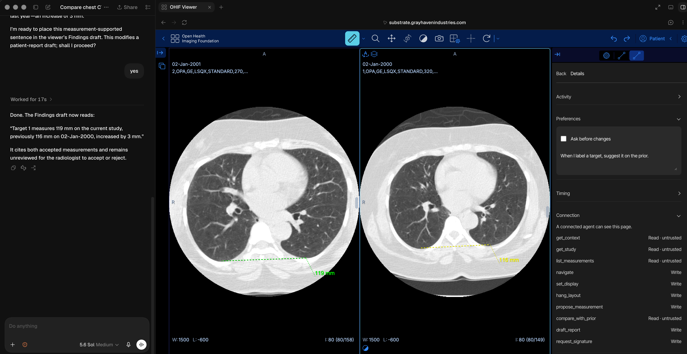

# Substrate

Substrate adds a browser-native agent workflow to the stock [OHIF medical imaging viewer](https://ohif.org/). A radiologist reads the images. An agent uses WebMCP to arrange studies, navigate, apply display presets, organize human measurements, compare timepoints, and draft traceable findings.

**This application is for research use only. Do not use it for clinical diagnosis. The FDA has not cleared it.**



## Try the live demo

Open the [public chest CT study](https://substrate.grayhavenindustries.com/viewer?StudyInstanceUIDs=1.2.840.113654.2.55.302957049620416109572494829313844992999) in ChatGPT's in-app browser. The site requires no account.

Prompt the connected agent in natural language:

> Put this chest CT next to last year's, use lung windows for both, and take both to slice 80.

The agent must call `get_context` before it changes the viewer. You do not need to name the tools during normal use.

[Watch the demo video on YouTube](https://youtu.be/WcEev2iTRRo).

## Why WebMCP fits radiology workflow

Medical image viewers contain state that browser automation cannot reliably recover. This state includes studies, series, viewports, slices, display settings, measurements, and reports. WebMCP exposes this state through a bounded tool surface. The agent does not infer the state from pixels or click coordinates.

This split lets the radiologist keep the diagnostic work while the agent handles the surrounding workflow. The agent can prepare and organize the reading. It cannot interpret an image, invent a finding, accept a proposal, sign, or export.

## What the person and agent do together

The agent can:

- Find current and prior series
- Hang two timepoints side by side
- Navigate each viewport to a slice or existing measurement
- Apply window, level, orientation, and zoom settings
- Organize measurements created by the radiologist
- Propose an existing measurement on a compatible timepoint
- Compare accepted measurements
- Draft findings that cite accepted measurements
- Open signature review

The radiologist draws and adjusts measurements, accepts or rejects proposals, reviews findings, signs, and exports. Substrate records recent agent actions and keeps every workflow write undoable.

## The WebMCP implementation

Substrate registers ten tools through `document.modelContext.registerTool` during the OHIF mode lifecycle. A shared `AbortController` removes the tool batch when the mode exits. Tool descriptions, JSON Schemas, read-only annotations, validation, execution, and lifecycle adaptation live in [`extensions/substrate/src/webmcp`](extensions/substrate/src/webmcp).

| Tool | Access | Purpose |
|---|---|---|
| `get_context` | Read | Describe the open studies, viewports, workflow, report, and signature state |
| `get_study` | Read | List series and discover prior studies |
| `list_measurements` | Read | List human measurements and proposal state |
| `compare_with_prior` | Read | Compare accepted measurement pairs |
| `navigate` | Write | Move a viewport to a slice or measurement |
| `set_display` | Write | Apply display presets, orientation, and zoom reset |
| `hang_layout` | Write | Set the viewport grid and assign series |
| `propose_measurement` | Write | Copy a human measurement to a compatible timepoint as a proposal |
| `draft_report` | Write | Assemble findings from accepted evidence |
| `request_signature` | Write | Open human signature review |

No tool returns pixel data or accepts coordinates selected by the agent. `propose_measurement` requires an existing human measurement and matching DICOM frame of reference. `draft_report` only cites accepted evidence. `request_signature` returns `pending`. Only the radiologist can sign or export.

Read the [implementation and safety details](SUBSTRATE.md) for the complete contract.

## Run locally

Install these prerequisites:

- Node.js 20
- Yarn 1.22
- Docker
- Python 3.12

Install dependencies:

```bash
yarn install --frozen-lockfile
```

Start an Orthanc archive with its DICOMweb plugin:

```bash
docker run --rm -d \
  --name substrate-orthanc \
  -p 8042:8042 \
  -e ORTHANC__AUTHENTICATION_ENABLED=false \
  -e ORTHANC__REMOTE_ACCESS_ALLOWED=true \
  orthancteam/orthanc:26.8.2-full
```

Seed the two attributed National Lung Screening Trial series:

```bash
python3 scripts/seed-orthanc.py
```

Start OHIF with the Substrate extension:

```bash
cd platform/app
OHIF_PORT=3010 yarn dev:substrate
```

Open `http://localhost:3010/viewer?StudyInstanceUIDs=1.2.840.113654.2.55.302957049620416109572494829313844992999`.

ChatGPT's in-app browser supports WebMCP. If you use Chrome 149 or later, enable `chrome://flags/#enable-webmcp-testing`. Then restart Chrome.

## Verify the implementation

Run the WebMCP unit and deterministic acceptance suites:

```bash
yarn workspace @substrate/extension-substrate test:unit:ci
yarn workspace @substrate/extension-substrate typecheck
```

The suite contains 52 tests across registration compatibility, lifecycle cancellation, input validation, OHIF postconditions, undo, proposal safety, report integrity, and the S1 through S7 workflow. The [acceptance record](docs/acceptance/s1-s7/README.md) distinguishes deterministic contract coverage from native-browser smoke coverage.

## Hackathon provenance

OHIF is the pre-existing application. Substrate is the WebMCP extension created during the OpenAI WebMCP Challenge submission period. The first Substrate commit is dated September 2, 2026, and the subsequent commit history records the implementation through September 3, 2026.

The new work includes:

- `extensions/substrate/`: WebMCP tools, workflow engine, agent panel, report review, signing, and tests
- `modes/substrate/`: OHIF mode integration
- `platform/app/public/config/substrate.js`: local viewer configuration
- `platform/app/public/config/substrate-railway.js`: production viewer configuration
- `deploy/` and `seed/`: hosted demo infrastructure
- `scripts/seed-orthanc.py`: local public-data seeding
- `DESIGN.md`, `SUBSTRATE.md`, and `docs/acceptance/`: product contract and evidence

Read [`HACKATHON.md`](HACKATHON.md) for the dated boundary between upstream OHIF and hackathon work.

## Data and privacy

The hosted demo uses two de-identified, public National Lung Screening Trial CT series. The production seed replaces their display identity with a made-up demo identity. [`DATA_ATTRIBUTION.md`](DATA_ATTRIBUTION.md) records exact identifiers, source, and Creative Commons Attribution 4.0 licensing.

Do not upload protected health information. The hosted application exists only for research demonstration.

## License and upstream project

The repository uses the [MIT License](LICENSE). OHIF remains copyright Open Health Imaging Foundation and its contributors. The same license applies to the Substrate modifications.

This repository derives from [OHIF/Viewers](https://github.com/OHIF/Viewers). See OHIF's [documentation](https://docs.ohif.org/) for the upstream viewer architecture and features.
