# Dogfood Report: Substrate

| Field | Value |
|-------|-------|
| **Date** | 2026-09-03 |
| **App URL** | https://substrate.grayhavenindustries.com |
| **Session** | substrate-hosted |
| **Scope** | Hosted production app: study navigation, viewer, sidebar, WebMCP, report/signature, SR/PDF export |

## Summary

| Severity | Count |
|----------|-------|
| Critical | 0 |
| High | 2 |
| Medium | 3 |
| Low | 0 |
| **Total** | **5** |

## Remediation status

All five findings are fixed in the local working tree and remain undeployed.
The local verification repeated the native WebMCP flow and the affected UI at
1280×720:

- The collapsed dock measures 0px and the viewport grid reclaims its width;
  reopening restores the 320px dock.
- The signature plate keeps both report sentences, every review action, the
  attestation, identity field, and signing actions visible.
- Viewer writes use a frame-only ring; their caption remains in the state line
  and Recent work, with no chip or persistent dot over the viewer.
- Assist decisions render in the docked panel or collapsed status strip, never
  below or over a viewport.
- Current object-shaped WebMCP calls work natively, and a covered compatibility
  adapter normalizes Chrome's string-shaped `navigator.modelContext` preview.

## Acceptance coverage

- Production DNS, TLS, app root, viewer route, and `/healthz`: pass.
- Worklist: 2 studies listed with 158 and 149 instances; both current and prior images load.
- Native WebMCP enumeration: pass, 10 tools exposed.
- Read sequence: `get_context`, `get_study`, `list_measurements`, and `compare_with_prior`: pass.
- Reversible writes: `hang_layout`, `set_display`, and `navigate`: pass.
- Guardrails: unknown series returns `NO_SUCH_SERIES`; missing source measurement returns `NEEDS_SOURCE`.
- Assist mode: request waits for a human choice; `Skip` resolves as `DECLINED` with an instruction not to retry.
- Report/signature handoff: draft and signature request succeed; signing remains disabled without required human review and a name.
- Details navigation: preference state survives navigation back to the main Agent Work view.
- Performance at the hosted viewer: TTFB 73.5 ms, FCP 692 ms, LCP 1.276 s, CLS 0.01.
- Browser exceptions: none. Console contains existing OHIF warnings but no uncaught error during the acceptance flow.

## Scope limitation

SR/PDF export was not executed. Repository safety rules prohibit the agent from signing or exporting; this run stopped at the correctly guarded human signature boundary.

## Issues

### ISSUE-001: Collapsing Agent Work leaves the right panel width empty

| Field | Value |
|-------|-------|
| **Severity** | medium |
| **Category** | ux / visual |
| **URL** | https://substrate.grayhavenindustries.com/viewer?StudyInstanceUIDs=1.2.840.113654.2.55.302957049620416109572494829313844992999 |
| **Repro Video** | videos/issue-001-repro.webm |

**Description**

The `Collapse` action removes the Agent Work contents but does not reclaim the docked panel's width. Roughly one quarter of the window remains an empty black surface, so both CT viewports stay compressed. Expected: collapsing the panel should expand the viewport grid into the released horizontal space while showing the compact status strip.

**Repro Steps**

1. Open a study and open the Agent Work panel.
   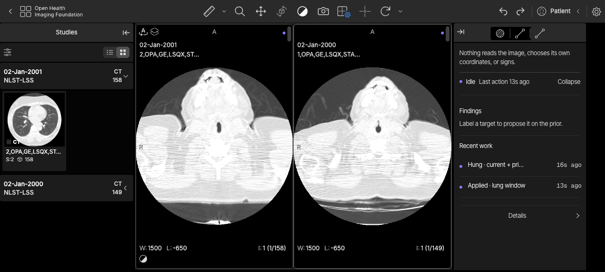

2. Click `Collapse`.
   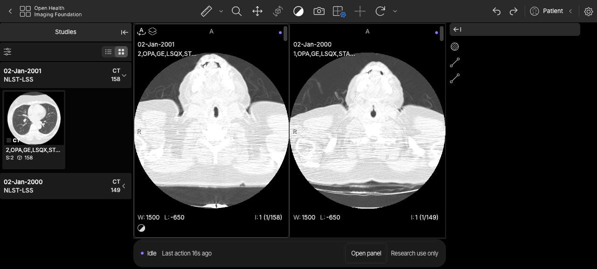

3. **Observe:** the panel contents disappear, but its entire horizontal allocation remains empty and the images do not expand.
   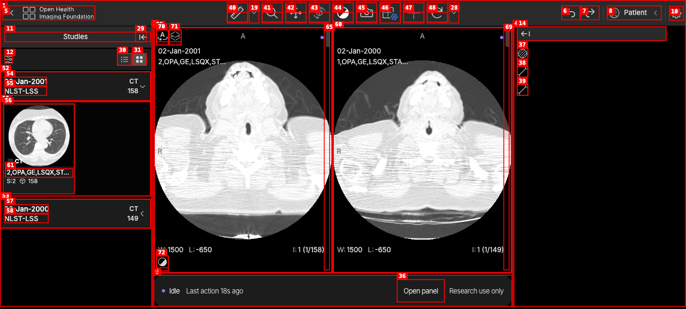

---

### ISSUE-005: WebMCP tool contracts require JSON strings instead of API objects

| Field | Value |
|-------|-------|
| **Severity** | medium |
| **Category** | functional |
| **URL** | https://substrate.grayhavenindustries.com/viewer?StudyInstanceUIDs=1.2.840.113654.2.55.302957049620416109572494829313844992999 |
| **Repro Video** | N/A — API contract issue; console evidence in `webmcp-api-contract.txt` |

**Description**

The hosted app exposes 10 tools through the native `navigator.modelContext`, but each registered tool's `inputSchema` is a string and the current WebMCP-shaped call `executeTool(tool, {})` fails with `UnknownError: Failed to parse input arguments`. Passing the arguments as the non-standard string `"{}"` succeeds. The current WebMCP IDL defines `inputSchema` and `inputObject` as objects, so a standards-conforming in-page agent cannot invoke Substrate without an implementation-specific serialization workaround.

**Repro Steps**

1. Retrieve `get_context` with `navigator.modelContext.getTools()` and inspect `typeof tool.inputSchema`; it returns `"string"`.
2. Call `navigator.modelContext.executeTool(tool, {})`.
3. **Observe:** the promise rejects with `UnknownError: Failed to parse input arguments`.
4. Call `navigator.modelContext.executeTool(tool, "{}")`; the same tool succeeds.

Evidence: [`webmcp-api-contract.txt`](webmcp-api-contract.txt). Specification: https://webmachinelearning.github.io/webmcp/

---

### ISSUE-004: Assist confirmation controls are clipped by the viewport footer

| Field | Value |
|-------|-------|
| **Severity** | high |
| **Category** | functional / visual |
| **URL** | https://substrate.grayhavenindustries.com/viewer?StudyInstanceUIDs=1.2.840.113654.2.55.302957049620416109572494829313844992999 |
| **Repro Video** | videos/issue-004-repro.webm |

**Description**

With `Ask before changes` enabled, a WebMCP `set_display` request correctly waits for the radiologist, but its confirmation card is anchored below the active viewport's usable area. At 1280×720 the card label and most of the `Skip` / `Apply` controls are cut off by the bottom status strip. Expected: the complete decision surface must remain visible and operable without covering diagnostic pixels or requiring hidden overflow.

**Repro Steps**

1. Open Agent Work → Details and enable `Ask before changes`.
   

2. Invoke `set_display` through WebMCP for the active viewport.
   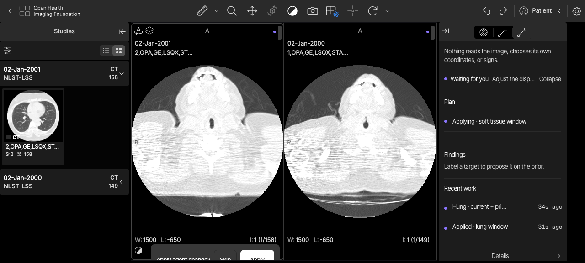

3. **Observe:** the confirmation card is clipped at the bottom edge; only the upper portions of `Skip` and `Apply` remain visible.
   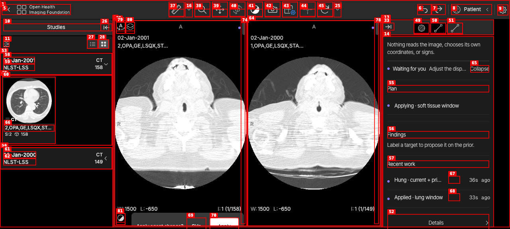

---

### ISSUE-003: Agent change caption is drawn inside the diagnostic viewport

| Field | Value |
|-------|-------|
| **Severity** | medium |
| **Category** | visual / ux |
| **URL** | https://substrate.grayhavenindustries.com/viewer?StudyInstanceUIDs=1.2.840.113654.2.55.302957049620416109572494829313844992999 |
| **Repro Video** | videos/issue-003-repro.webm |

**Description**

After WebMCP navigates a pane, the temporary `slice 78` attribution chip is positioned within the viewport's image bounds. It happens to sit over black background on this axial slice, but the same placement can cover anatomy on other images or orientations. Expected: the transient caption should attach to the viewport frame and never occupy diagnostic pixels.

**Repro Steps**

1. Open the hosted current/prior comparison.
   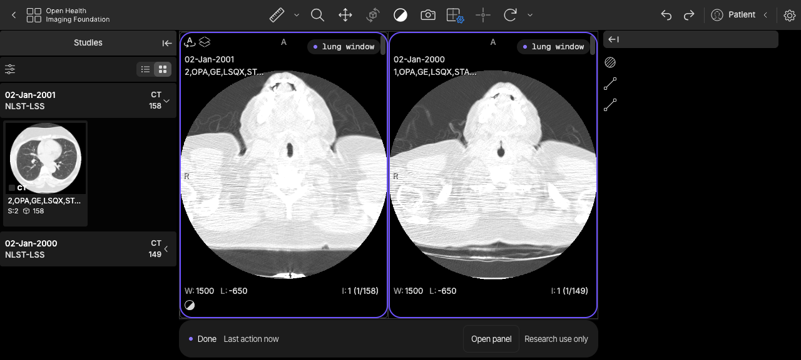

2. Invoke `navigate` for the active pane with `slice_index: 77`.
   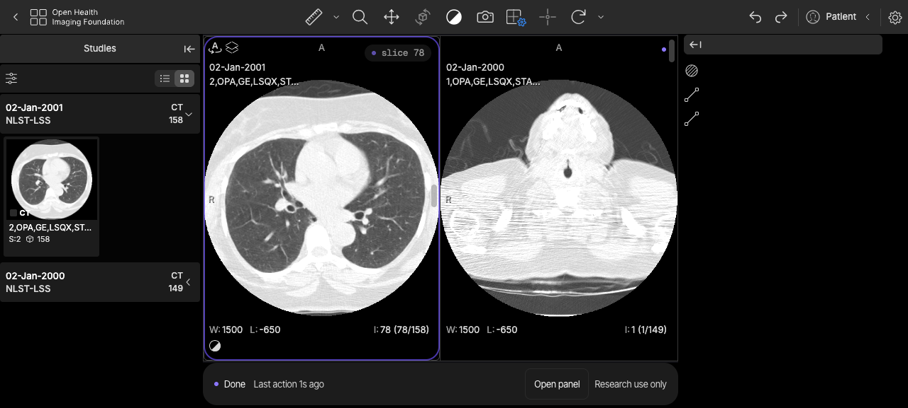

3. **Observe:** the `slice 78` chip renders inside the upper-right corner of the image viewport.
   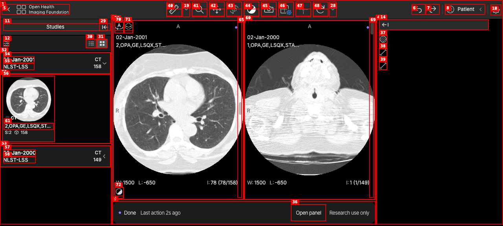

---

### ISSUE-002: Signature modal clips report text and hides review controls

| Field | Value |
|-------|-------|
| **Severity** | high |
| **Category** | visual / functional |
| **URL** | https://substrate.grayhavenindustries.com/viewer?StudyInstanceUIDs=1.2.840.113654.2.55.302957049620416109572494829313844992999 |
| **Repro Video** | videos/issue-002-repro-2.webm |

**Description**

At the default 1280×720 browser viewport, requesting a signature for a report with unsupported sentences opens a modal whose sentence rows overflow horizontally. The beginnings of both sentences and the attestation are clipped, and the required `Keep` / `Leave out` button labels are not visibly rendered. The accessibility tree still exposes the controls, but a sighted radiologist cannot reliably review the exact text or understand how to resolve the two required review items. This blocks the core signing workflow.

**Repro Steps**

1. Open the hosted study and draft a report containing two deliberately unsupported sentences through WebMCP.
   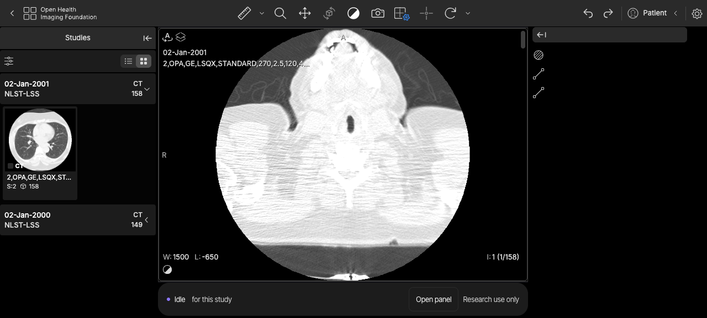

2. Invoke `request_signature` through WebMCP.
   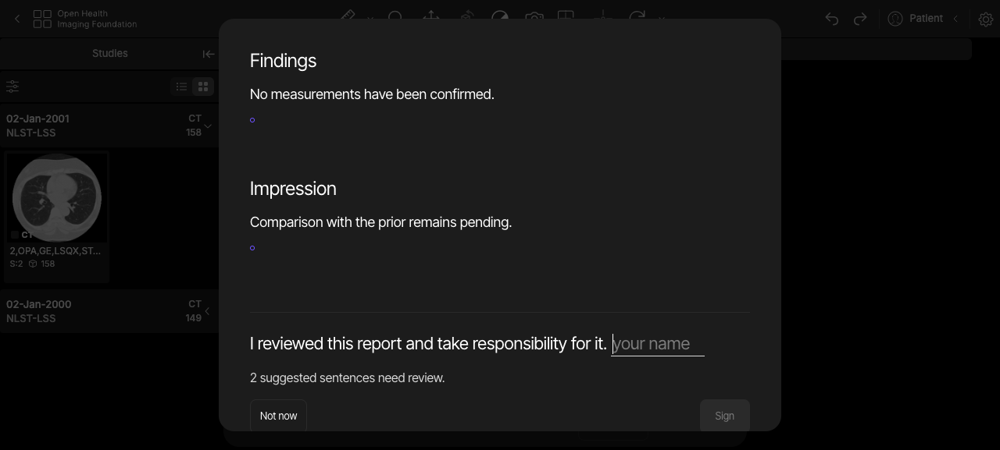

3. **Observe:** sentence beginnings and attestation text are clipped, while the two pairs of review controls appear as unlabeled dark boxes.
   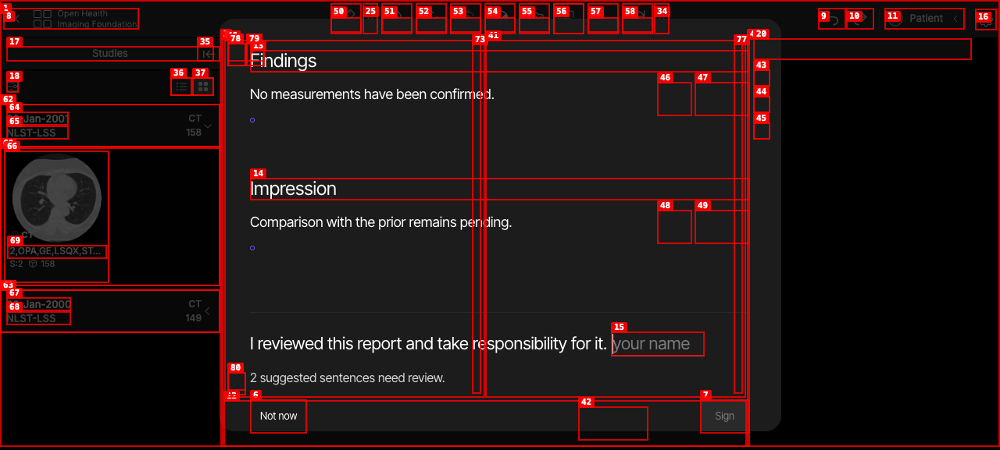

---
